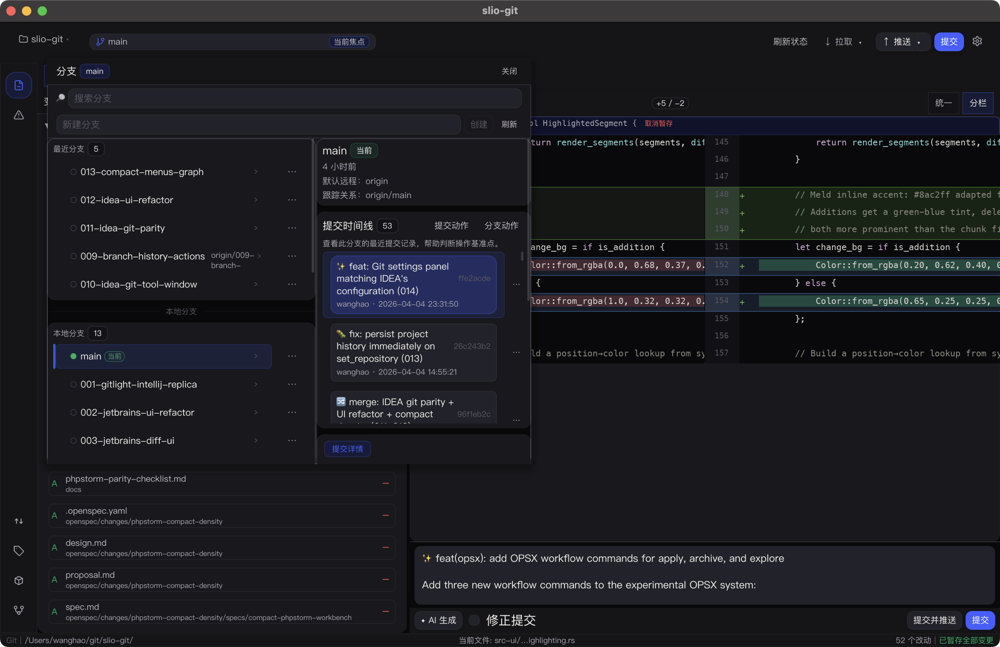

<div align="center">

# slio-git

**A fast, native Git GUI for developers who think in branches and diffs.**

*Built with Rust + Iced. Inspired by JetBrains IDEA. No Electron.*

[](https://www.rust-lang.org/)
[](https://iced.rs)
[](https://github.com/sk-wang/slio-git/releases/latest)
[](LICENSE-MIT)

</div>

<p align="center">
  
</p>

---

## Why slio-git

Most Git GUIs are either Electron-heavy or missing the workflow polish that makes IDEA's Git tool window great. slio-git brings that experience as a standalone, native app:

- **Instant startup** --- native binary, no runtime overhead
- **IDEA-familiar UI** --- branch popup, commit panel, push/pull dialogs, context menus --- all in the layout developers already know
- **Character-level diffs** --- Meld-quality inline highlighting with unified and side-by-side views
- **AI commit messages** --- generate conventional commit messages from staged diffs via any OpenAI-compatible API
- **i18n** --- full English and Chinese support with system locale auto-detection

## Install

### macOS

Download **slio-git.dmg** from the [latest release](https://github.com/sk-wang/slio-git/releases/latest).

### Windows

Download **slio-git-windows-x86_64.zip** from the [latest release](https://github.com/sk-wang/slio-git/releases/latest), extract it, and run `slio-git.exe`.

### Build from source

```bash
git clone https://github.com/sk-wang/slio-git.git
cd slio-git
cargo build --release -p src-ui
# Binary: target/release/src-ui

# Or build the macOS .app bundle:
bash scripts/package-macos-dmg.sh

# Or cross-compile a Windows ZIP release:
bash scripts/package-windows-zip.sh
```

Requires Rust 1.70+ and macOS 12+ / Linux / Windows 10+.

Linux packaging is available through `bash scripts/package-linux-tarball.sh`, which creates `dist/slio-git-linux-<arch>.tar.gz`.

## Release Automation

This repository includes a manual GitHub Actions release workflow at `.github/workflows/release.yml`.

1. Open **Actions** → **Release** → **Run workflow**.
2. Fill in the release `version` from `Cargo.toml` exactly as-is and the `release_title`.

The workflow validates the requested version against `Cargo.toml`, builds macOS (`x86_64`, `aarch64`), Windows (`x86_64`, `aarch64`), and Linux (`x86_64`, `aarch64`) release archives, generates `SHA256SUMS.txt`, and publishes a GitHub Release whose body includes a compare link from the previous release tag to the new tag plus the file checksums.

## Features

### Changes & Staging

Stage individual files, hunks, or everything at once. The file list supports both flat and tree views. Right-click any file for quick actions: stage, view diff, discard, show history, copy path, or open in your editor.

### Diff Viewer

Switch between **unified** and **side-by-side** views. Both support syntax highlighting, character-level inline change markers (Meld-style 3-char kmer filtering), and hunk navigation with `F7` / `Shift+F7`.

### Branch Management

IDEA-style branch popup with search filtering, folder grouping, and tracking info. Right-click any branch for checkout, merge, rebase, compare, rename, or delete. Smart checkout handles uncommitted changes automatically (stash + switch + unstash).

### Commit

Embedded commit panel at the bottom with amend toggle and message history. The full commit dialog (`Ctrl+K`) shows a file list with selective staging. AI commit message generation considers your branch name, recent log, and staged diff.

### History & Log

Full commit history with graph visualization, search/filter, and keyboard navigation. Right-click any commit for cherry-pick, revert, reset, create branch/tag, interactive rebase, or copy hash. Switch between Changes and Log with `Ctrl+L` / `Ctrl+Shift+L`.

### Merge Conflicts

Three-pane conflict resolver (ours / result / theirs) with per-conflict navigation, accept-ours/theirs buttons, and auto-merge. Integrates directly into the changes workflow.

### Remote Operations

Pull and push dialogs with strategy options (merge, rebase, ff-only), force-push with lease, tag pushing, and upstream configuration.

### More

- **Stash** --- save, pop, apply, drop, clear, unstash as branch
- **Tags** --- create annotated/lightweight, push, delete local and remote
- **Interactive Rebase** --- todo editor with pick/reword/edit/squash/fixup/drop, continue/skip/abort
- **Worktrees** --- create, list, remove
- **Settings** --- commit, push, update, fetch, LLM API configuration, and language selection

## Keyboard Shortcuts

| Shortcut | Action |
|----------|--------|
| `Ctrl+K` | Open commit dialog |
| `Ctrl+Shift+K` | Open push dialog |
| `Ctrl+L` | Switch to Log tab |
| `Ctrl+Shift+L` | Switch to Changes tab |
| `Ctrl+S` / `Ctrl+U` | Stage / Unstage selected file |
| `Ctrl+Shift+S` / `Ctrl+Shift+U` | Stage all / Unstage all |
| `Ctrl+D` | Show diff |
| `Ctrl+R` | Refresh |
| `F7` / `Shift+F7` | Next / Previous hunk |
| `Ctrl+Alt+Right` / `Left` | Next / Previous file |
| `Ctrl+Shift+Z` / `Ctrl+Z` | Stash save / Stash pop |

## Architecture

```
┌─────────────────────────┐
│      Iced 0.14 UI       │  Views, widgets, theme, i18n
└────────────┬────────────┘
             │
┌────────────┴────────────┐
│        git-core         │  Blame, graph, LLM, diff, rebase,
│                         │  remote, stash, tag, worktree
└────────────┬────────────┘
             │
┌────────────┴────────────┐
│   libgit2 (git2-rs)     │
└─────────────────────────┘
```

| Layer | Technology |
|-------|-----------|
| UI | [Iced 0.14](https://iced.rs) --- native Rust GUI, GPU-accelerated via wgpu |
| Git | [git2-rs 0.19](https://github.com/rust-lang/git2-rs) --- libgit2 bindings |
| Diff | [similar](https://github.com/mitsuhiko/similar) --- character-level inline diff |
| Syntax | [syntect](https://github.com/trishume/syntect) --- syntax highlighting |
| Watch | [notify](https://github.com/notify-rs/notify) --- file system change detection |

## License

Licensed under either of [Apache License, Version 2.0](LICENSE-APACHE) or [MIT License](LICENSE-MIT) at your option.
